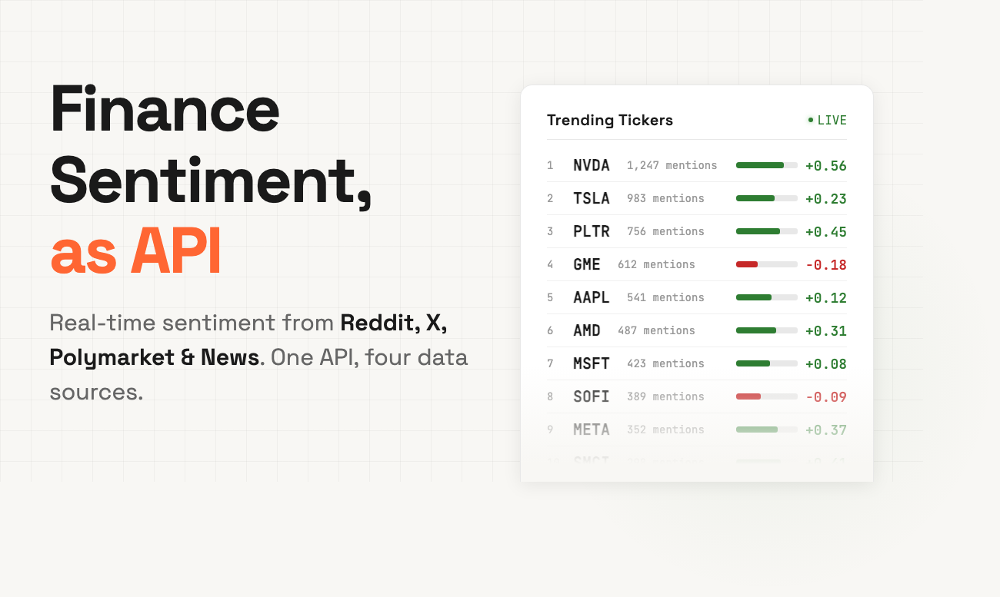

<p align="center">
  <a href="https://adanos.org">
    
  </a>
</p>

# Adanos Software

Adanos builds trading APIs, sentiment analytics, stock alerts, and live rankings for financial markets.

<p align="center">
  <a href="https://pypi.org/project/adanos/">
    
  </a>
  <a href="https://pypi.org/project/adanos-cli/">
    
  </a>
  <a href="https://www.npmjs.com/package/finance-sentiment">
    
  </a>
</p>

<p align="center">
  <a href="https://github.com/adanos-software/adanos-cli">
    
  </a>
  <a href="https://github.com/adanos-software/adanos-python-sdk">
    
  </a>
  <a href="https://github.com/adanos-software/adanos-ts-sdk">
    
  </a>
</p>

We focus on developer-first market infrastructure for:
- traders
- fintech products
- quant and research teams
- AI agents and automation

## What Adanos does

Our platform turns noisy market discussion into structured signals and usable tools.

Today, that includes:
- stock sentiment across Reddit, X, financial news, and Polymarket
- crypto sentiment coverage from Reddit crypto communities
- REST APIs, JSON-first tooling, and terminal workflows
- products designed for both humans and machine-driven systems

## What you’ll find in this GitHub organization

This organization is the public home for Adanos open-source and developer-facing tooling.

Here you’ll find:
- official CLI tooling for the Adanos Finance Sentiment API
- release workflows and distribution assets
- future SDKs, integrations, and developer tooling from Adanos Software

## Start here

- Website: [adanos.org](https://adanos.org)
- API docs: [api.adanos.org/docs](https://api.adanos.org/docs)
- CLI: [adanos-software/adanos-cli](https://github.com/adanos-software/adanos-cli)
- Python SDK: [adanos-software/adanos-python-sdk](https://github.com/adanos-software/adanos-python-sdk)
- TypeScript SDK: [adanos-software/adanos-ts-sdk](https://github.com/adanos-software/adanos-ts-sdk)

## Official packages

### `adanos-cli`

The official command-line client for the Adanos Finance Sentiment API.

Built for:
- natural-language market queries in the terminal
- stock and crypto scans, briefings, consensus views, and watchlists
- stable JSON output for agents and automation

Install:

```bash
pipx install adanos-cli
curl -fsSL https://raw.githubusercontent.com/adanos-software/adanos-cli/main/install.sh | bash
brew install adanos-software/tap/adanos-cli
```

Repo: [adanos-software/adanos-cli](https://github.com/adanos-software/adanos-cli)

### `adanos`

The official Python SDK for Adanos market sentiment APIs.

Built for:
- backend services and internal tools
- quantitative workflows and notebooks
- agents and automation that want a typed Python client

Install:

```bash
pip install adanos
```

Repo: [adanos-software/adanos-python-sdk](https://github.com/adanos-software/adanos-python-sdk)

### `finance-sentiment`

The official TypeScript and JavaScript SDK for Adanos market sentiment APIs.

Built for:
- Node.js services and edge functions
- frontends and dashboards
- agent workflows in TypeScript

Install:

```bash
npm install finance-sentiment
```

Repo: [adanos-software/adanos-ts-sdk](https://github.com/adanos-software/adanos-ts-sdk)

## What powers the platform

Adanos products currently cover:
- Reddit Stocks
- X / Twitter Stocks
- Stock News
- Polymarket Stocks
- Reddit Crypto

We build these products to make market sentiment easier to query, compare, automate, and ship into real workflows.

## Why this exists

We believe trading infrastructure should be:
- fast enough for real market use
- simple enough for developers to integrate quickly
- structured enough for AI agents to use reliably

More public repos will appear here over time as we open-source more of the Adanos developer stack.
